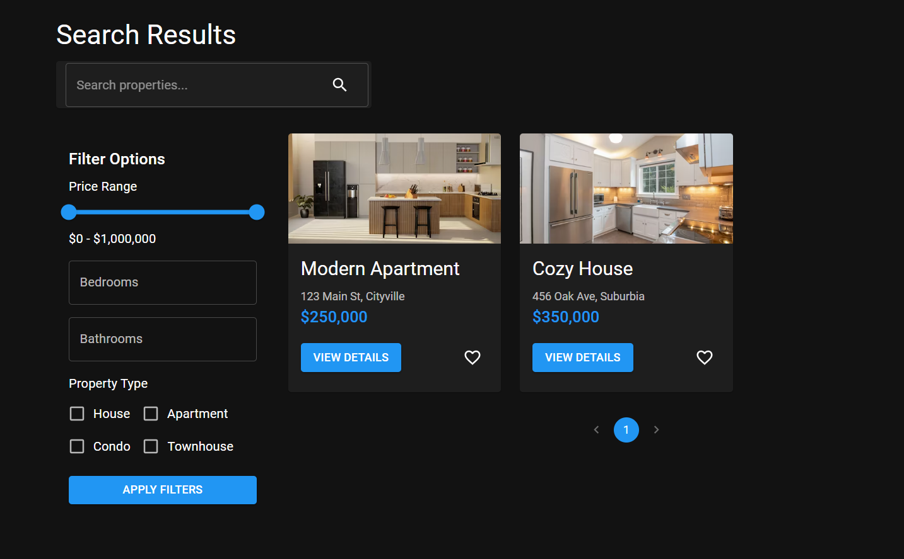

# REAL ESTATE (build by CodeCraft in 20 minutes)



## Project Overview

A Real Estate application with mocked data, built using React and Material-UI v5.

## DEMO

https://real-estate-max.netlify.app

## Tech Stack

-   React
-   React Router v6
-   Material-UI v5
-   Mock data instead of API calls
-   Redux for state management
-   Styled-components for custom styling

## Branding

-   Primary color: Blue (#1976D2)
-   Secondary color: Light Gray (#F5F5F5)
-   Accent color: Orange (#FF9800)
-   Typography: Roboto font family

## Features

-   Property listings with infinite scroll
-   Detailed property view with image gallery
-   Advanced search functionality with auto-suggestions
-   Multi-select filtering options
-   User authentication and profile management
-   Favorites/Saved properties with local storage persistence
-   Responsive design with mobile-first approach
-   Dark mode support with theme switcher
-   Share property listings on social media
-   Print-friendly property details

## Project Structure

```
src/
  components/
    common/
      Button.js
      Input.js
      Modal.js
    FilterOptions.js
    PropertyCard.js
    SearchBar.js
    ImageGallery.js
    ThemeSwitcher.js
  pages/
    Favorites.js
    HomePage.js
    Login.js
    PropertyDetails.js
    Register.js
    SearchResults.js
    UserProfile.js
  services/
    propertyService.js
    authService.js
  hooks/
    useDebounce.js
    useInfiniteScroll.js
  context/
    ThemeContext.js
  redux/
    actions/
    reducers/
    store.js
  utils/
    formatters.js
    validators.js
  App.js
  index.js
  theme.js
public/
  index.html
  manifest.json
  robots.txt
  assets/
    images/
    icons/
```

## Design Considerations

-   Implement a design system for consistent UI components
-   Use CSS Grid and Flexbox for responsive layouts
-   Implement skeleton screens for loading states
-   Add micro-interactions and animations for better UX
-   Ensure color contrast ratios meet WCAG 2.1 AA standards
-   Implement error boundaries for graceful error handling
-   Use React.Suspense and React.lazy for code splitting

## Performance Optimizations

-   Implement Redux with Redux Toolkit for efficient state management
-   Use React.memo and useMemo for component and value memoization
-   Implement service workers for offline support and faster load times
-   Use Intersection Observer API for lazy loading images
-   Optimize bundle size with tree shaking and code splitting
-   Implement server-side rendering for improved initial load time

## Future Enhancements

-   Integration with real estate APIs (e.g., Zillow, Realtor.com)
-   Interactive map view with clustering for property locations
-   360-degree virtual property tours
-   AI-powered chatbot for user inquiries
-   Mortgage calculator with personalized recommendations
-   User reviews and ratings for properties and agents
-   Advanced search with natural language processing
-   Property price prediction using machine learning
-   Integration with smart home devices for virtual home tours
-   Blockchain integration for secure property transactions

## Getting Started

1. Clone the repository
2. Install dependencies: `npm install`
3. Set up environment variables: Copy `.env.example` to `.env` and fill in the values
4. Start the development server: `npm start`

## Testing

-   Unit tests: `npm run test`
-   Integration tests: `npm run test:integration`
-   End-to-end tests: `npm run test:e2e`
-   Test coverage: `npm run test:coverage`

## Deployment

-   Build for production: `npm run build`
-   Deploy to Netlify: `npm run deploy:netlify`
-   Deploy to Vercel: `npm run deploy:vercel`

## Contributing

Please read CONTRIBUTING.md for details on our code of conduct and the process for submitting pull requests.

## License

This project is licensed under the MIT License - see the LICENSE.md file for details.

## Acknowledgments

-   Material-UI team for the excellent component library
-   React community for continuous support and inspiration
-   Open source contributors for various libraries used in this project
